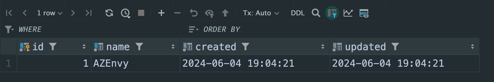
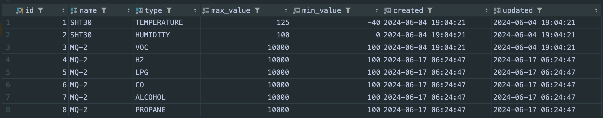
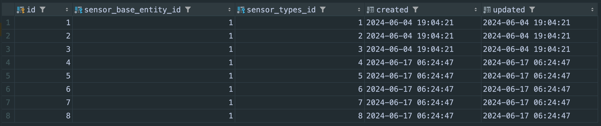

# AirQualityHome Server - Spring Boot Project
## Getting started
This is a small student project setting up a MySQL (MariaDB) database and a server for 
room climate surveillance.

With help of this project you can create your own sensors combinations sending their
data in the specified data structure to our server.

This a Spring Boot maven project using Java 17. Please ensure you have completed the following
requirements:

- Installed at least an [OpenJDK](https://openjdk.org/) Version which supports Java 17
- Installed [Maven](https://maven.apache.org/install.html) 
- Installed [Git](https://git-scm.com/book/en/v2/Getting-Started-Installing-Git) as a VCS
- Setup your JAVA_HOME variable correctly
- Added maven to the PATH variable

## Clone the repository
Clone the repository to a directory of your choice with:
`git clone https://github.com/harald78/airqualityhome-server.git`

## Installing the database
First of all the database has to be setup on your home server. Please follow the
instructions [here](setup/database/README.md).

## Installing the server
Next you can setup the server project. Please follow this instructions [here](setup/server/README.md).

## Creating your own sensor base
You can create your own sensor base matching your requirements for air quality surveillance. An example
project can be found [here](https://github.com/harald78/az-envy). If you don't want to setup your
own base you can purchase a AZEnvy environment board and install the software directly from the example 
project.

## Data structure for sensor registration
The registration request must have the following structure:

Example:
```
{
  "username": "<user-on-server>",
  "uuid": "<unique-sensor-id>"
}
```

## Data structure for sending measurement data
The data must have the following structure:

Example:
```
{
  "base": "<sensor-base-name>",
  "timestamp": "2024-06-26T19:16:06+0200",
  "id": "<unique-sensor-id>",
  "measurements": [
    {
      "type": "TEMPERATURE",
      "value": 32.28466034,
      "unit": "CELSIUS"
    },
    ...
  ]
}
```

## Setting up the sensor base in the database
If you have created your own sensor base with other sensor configurations you must do an initial
setup of this new base directly on database level.

### 1. Make an entry in the sensor_base Table
You can use a name of your choice. But make sure you use the same name you have used in the source
code of your sensor.




### 2. Make the entries in the sensor_type Table
For each sensor used on your microcontroller board make an entry in the sensor_type table. 
For now the following types can be used (ENUM):
- TEMPERATURE
- HUMIDITY
- CO
- CO2
- LPG
- H2
- ALCOHOL
- PROPANE
- PARTICLE
- LIGHT

The name property can be chosen freely but should usually be the technical name of the sensor used.



### 3. Connect sensor_type to sensor_base
The last step is to connect the sensor types used on your microcontroller board with your created
sensor base. For this make the necessary entries within the table sensor_base_sensor_types which
is a table for a many-to-many relationship:


