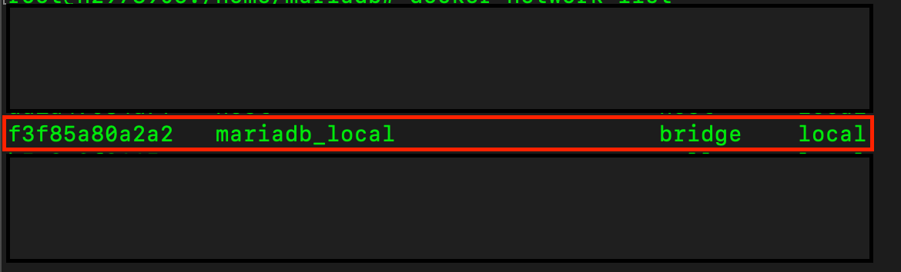
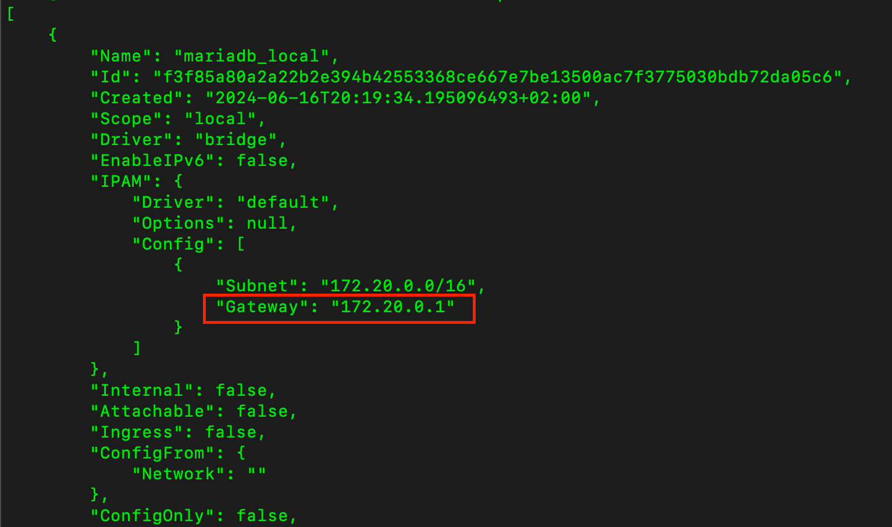

# MariaDB project database setup
## Getting started
Make sure you have access to your home server by using [SSH](https://www.digitalocean.com/community/tutorials/how-to-use-ssh-to-connect-to-a-remote-server).
Open a terminal session and copy the content of this directory to your home server. For this create a
directory e. g. `mkdir /home/mariadb` directly on your server.

Then copy the content of this directory to the created directory:

`scp ./ <username>@<host>:/home/mariadb`

## Requirements on your server
Please make sure you use at least a RaspberryPi 3B+ or better a RaspberryPi4 model with 4GB of RAM.
Install the latest RaspberryPi [OS](https://www.raspberrypi.com/software/) (64 bit version). Thereafter
install the following software if not already installed:

Docker:
```
sudo apt update
sudo apt install docker.io
```

Docker Compose
```
sudo apt-get install docker-compose
```

## Setting up the env_vars.sh
Please setup the env_vars.sh files with your secrets. Therefore replace all < > - Entries with suitable values. 
You can choose the secrets freely. Just make sure you use the same secrets for the server setup.
You can use the editor **nano** for setting up this file directly on your server.

<span style="color:orange">**Never store the secrets directly in a repository!!!**</span>

## Expose the variables
You can expose the variables with the following command:

`source env_vars.sh`

## Starting the database
To start the database server please use the following command:
`docker-compose up -d`

The -d flag option starts the server as a deamon (background) task. To see if your server has
been started correctly please use the command `docker ps -a`

## Inspect the Network Gateway
To setup the correct JDBC URL you must inspect the docker network and note the gateway IP
of the network the MariaDB runs in. Please use the following commands:
`docker network list`

Output: 


`docker network inspect <container-id>`

Output:

